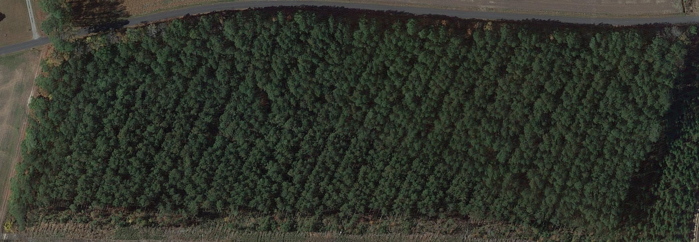
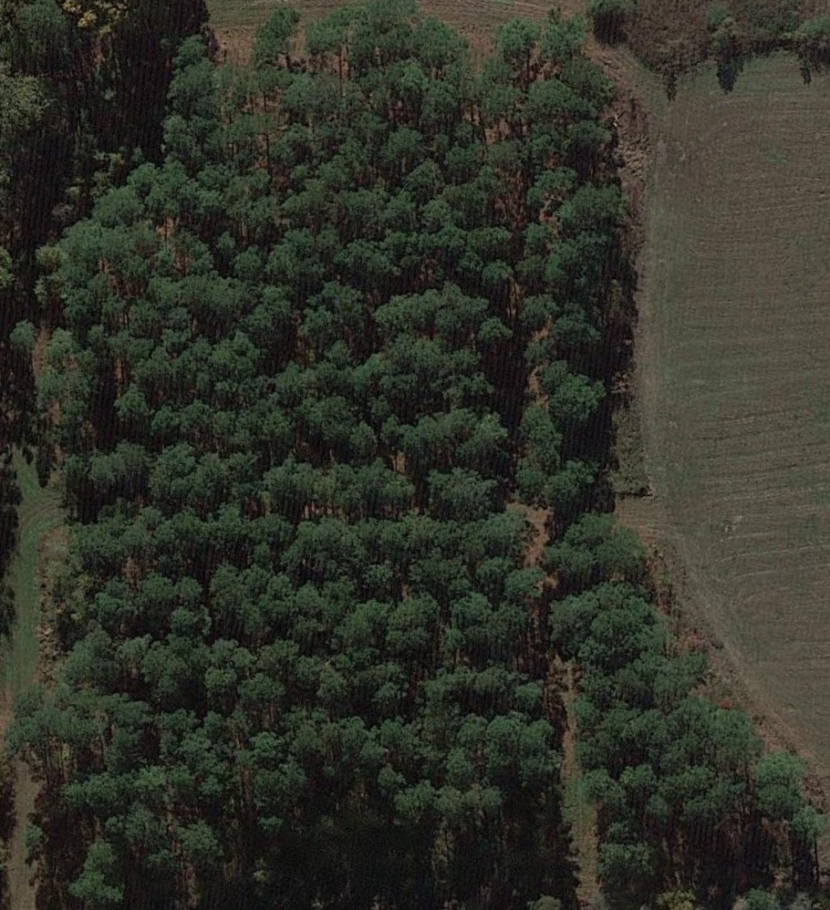
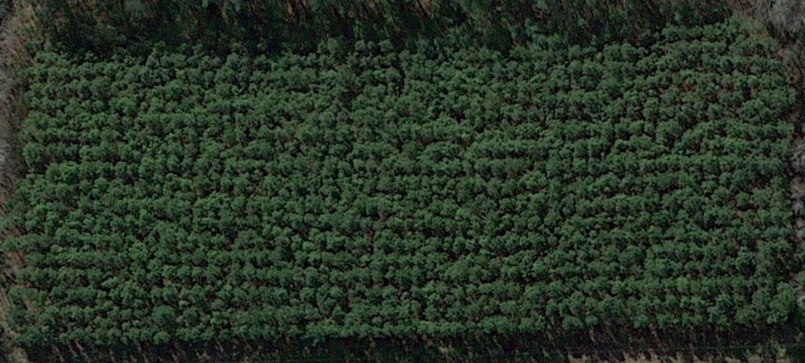

# data_set_bogdanova_4031
летняя практика, найти 100 фотографий искусственно высаженных деревьев, посчитать их количество и указать координаты

name | picture | amount | coordinates | source
:----|:-------:|:-------:|:-----------:|------:
0 | | 4409 | 35° 00' 33'' N, 87° 15' 57'' W | earth.google.com
1 | | 3569 | 35° 00' 15'' N, 87° 16' 00'' W | earth.google.com
2 | | 464 | 35° 01' 51'' N, 87° 20' 05'' W | earth.google.com
3 | | 1275 | 35° 02' 46'' N, 87° 20' 00'' W | earth.google.com
4 | | 1938 | 36° 34' 32'' N, 76° 14' 28'' W | earth.google.com
5 | | 1155 | 34° 46' 07'' N, 87° 06' 35'' W | earth.google.com
6 | | 2714 | 36° 35' 56'' N, 76° 33' 10'' W | earth.google.com
7 | | 1072 | 36° 35' 52'' N, 76° 33' 08'' W | earth.google.com
8 | | 3900 | 36° 36' 40'' N, 76° 35' 10'' W | earth.google.com
9 | | 525 | 36° 37' 03'' N, 76° 33' 13'' W | earth.google.com
10 | | 2012 | 36° 36' 40'' N, 76° 35' 21'' W | earth.google.com
11 | | 1358 | 36° 36' 54'' N, 76° 34' 14'' W | earth.google.com
12 | | 1036 | 36° 36' 56'' N, 76° 34' 24'' W | earth.google.com
13 | | 755 | 36° 36' 51'' N, 76° 34' 22'' W | earth.google.com
14 | | 241 | 36° 36' 48'' N, 76° 33' 09'' W | earth.google.com
15 | | 1248 | 35° 02' 41'' N, 87° 20' 00'' W | earth.google.com
16 | | 1020 | 34° 59' 31'' N, 87° 05' 27'' W | earth.google.com
17 | | 276 | 34° 59' 23'' N, 87° 05' 34'' W | earth.google.com
18 | | 973 | 34° 59' 20'' N, 87° 05' 32'' W | earth.google.com
19 | | 117 | 34° 59' 07'' N, 87° 05' 14'' W | earth.google.com
20 | | 200 | 34° 59' 21'' N, 87° 04' 49'' W | earth.google.com
21 | | 5041 | 36° 28' 47'' N, 76° 40' 43'' W | earth.google.com
22 | | 1689 | 36° 28' 32'' N, 76° 41' 03'' W | earth.google.com
23 | | 1433 | 36° 30' 06'' N, 76° 44' 05'' W | earth.google.com
24 | | 1212 | 36° 29' 53'' N, 76° 44' 47'' W | earth.google.com
25 | | 695 | 36° 29' 14'' N, 76° 45' 48'' W | earth.google.com
26 | | 703 | 36° 29' 21'' N, 76° 45' 48'' W | earth.google.com
27 | | 178 | 36° 29' 36'' N, 76° 45' 27'' W | earth.google.com
28 | | 660 | 36° 29' 40'' N, 76° 45' 27'' W | earth.google.com
29 | | 2567 | 36° 29' 02'' N, 76° 45' 30'' W | earth.google.com
30 | | 814 | 36° 28' 55'' N, 76° 45' 24'' W | earth.google.com
31 | | 766 | 36° 29' 56'' N, 76° 45' 27'' W | earth.google.com
32 | | 540 | 36° 31' 10'' N, 76° 45' 42'' W | earth.google.com
33 | | 406 | 36° 31' 10'' N, 76° 45' 49'' W | earth.google.com
34 | | 230 | 36° 31' 13'' N, 76° 45' 55'' W | earth.google.com
35 | | 755 | 36° 31' 02'' N, 76° 45' 52'' W | earth.google.com
36 | | 616 | 36° 31' 17'' N, 76° 45' 36'' W | earth.google.com
37 | | 158 | 36° 30' 30'' N, 76° 45' 03'' W | earth.google.com
38 | | 125 | 36° 30' 30'' N, 76° 44' 58'' W | earth.google.com
39 | | 2967 | 36° 28' 49'' N, 76° 43' 59'' W | earth.google.com
40 | | 97 | 36° 29' 09'' N, 76° 44' 45'' W | earth.google.com
41 | | 560 | 36° 27' 43'' N, 76° 44' 27'' W | earth.google.com
42 | | 890 | 36° 27' 41'' N, 76° 44' 20'' W | earth.google.com
43 | | 1425 | 36° 29' 08'' N, 76° 43' 33'' W | earth.google.com
44 | | 848 | 36° 28' 22'' N, 76° 42' 17'' W | earth.google.com
45 | | 1103 | 36° 26' 13'' N, 76° 43' 50'' W | earth.google.com
46 | | 1879 | 36° 26' 13'' N, 76° 44' 04'' W | earth.google.com
47 | | 702 | 36° 26' 41'' N, 76° 47' 37'' W | earth.google.com
48 | | 913 | 36° 27' 09'' N, 76° 47' 58'' W | earth.google.com
49 | | 417 | 36° 27' 18'' N, 76° 48' 03'' W | earth.google.com
50 | | 66 | 36° 28' 04'' N, 76° 48' 28'' W | earth.google.com
51 | | 218 | 36° 28' 05'' N, 76° 48' 30'' W | earth.google.com
52 | | 540 | 36° 28' 07'' N, 76° 48' 28'' W | earth.google.com
53 | | 332 | 36° 28' 10'' N, 76° 48' 26'' W | earth.google.com
54 | | 80 | 36° 28' 15'' N, 76° 48' 25'' W | earth.google.com
55 | | 2000 | 36° 28' 15'' N, 76° 48' 31'' W | earth.google.com
56 | | 1055 | 36° 28' 15'' N, 76° 48' 21'' W | earth.google.com
57 | | 1423 | 36° 28' 10'' N, 76° 48' 17'' W | earth.google.com
58 | | 492 | 36° 28' 28'' N, 76° 48' 38'' W | earth.google.com
59 | | 1156 | 36° 28' 40'' N, 76° 48' 39'' W | earth.google.com
60 | | 1452 | 36° 28' 36'' N, 76° 48' 50'' W | earth.google.com
61 | | 1745 | 36° 27' 45'' N, 76° 50' 02'' W | earth.google.com
62 | | 1843 | 36° 27' 46'' N, 76° 49' 53'' W | earth.google.com
63 | | 2744 | 36° 25' 16'' N, 76° 48' 51'' W | earth.google.com
64 | | 2300 | 36° 26' 29'' N, 76° 47' 34'' W | earth.google.com
65 | | 1104 | 36° 26' 04'' N, 76° 48' 59'' W | earth.google.com
66 | | 1012 | 36° 26' 31'' N, 76° 48' 56'' W | earth.google.com
67 | | 3484 | 36° 28' 56'' N, 76° 48' 30'' W | earth.google.com
68 | | 271 | 36° 30' 14'' N, 76° 48' 19'' W | earth.google.com
69 | | 1731 | 36° 30' 09'' N, 76° 48' 07'' W | earth.google.com
70 | | 380 | 36° 26' 31'' N, 76° 50' 48'' W | earth.google.com
71 | | 1397 | 36° 28' 16'' N, 76° 50' 23'' W | earth.google.com
72 | | 840 | 36° 28' 26'' N, 76° 50' 35'' W | earth.google.com
73 | | 650 | 36° 29' 22'' N, 76° 50' 50'' W | earth.google.com
74 | | 1120 | 36° 31' 16'' N, 76° 49' 11'' W | earth.google.com
75 | | 380 | 36° 30' 59'' N, 76° 50' 44'' W | earth.google.com
77 | | 1523 | 36° 27' 06'' N, 76° 35' 27'' W | earth.google.com
78 | | 255 | 36° 27' 45'' N, 76° 40' 34'' W | earth.google.com
79 | | 1788 | 36° 25' 01'' N, 76° 52' 23'' W | earth.google.com
80 | | 2069 | 36° 24' 58'' N, 76° 52' 27'' W | earth.google.com
81 | | 1431 | 33° 09' 43'' N, 93° 00' 25'' W | earth.google.com
82 | | 240 | 32° 58' 53'' N, 93° 09' 38'' W | earth.google.com
83 | | 140 | 32° 58' 34'' N, 93° 09' 45'' W | earth.google.com
84 | | 718 | 32° 58' 57'' N, 93° 09' 59'' W | earth.google.com
85 | | 950 | 32° 58' 55'' N, 93° 09' 58'' W | earth.google.com
86 | | 365 | 32° 58' 50'' N, 93° 09' 59'' W | earth.google.com
87 | | 135 | 33° 00' 08'' N, 93° 11' 34'' W | earth.google.com
88 | | 3858 | 32° 19' 02'' N, 93° 12' 48'' W | earth.google.com
90 | | 980 | 32° 09' 24'' N, 93° 22' 36'' W | earth.google.com
91 | | 633 | 34° 18' 36'' N, 85° 39' 06'' W | earth.google.com
93 | | 1723 | 34° 06' 26'' N, 85° 37' 06'' W | earth.google.com
94 | | 210 | 34° 06' 28'' N, 85° 37' 07'' W | earth.google.com
95 | | 850 | 34° 02' 51'' N, 85° 33' 51'' W | earth.google.com
96 | | 1249 | 33° 50' 52'' N, 85° 39' 57'' W | earth.google.com
97 | | 195 | 36° 27' 16'' N, 76° 52' 58'' W | earth.google.com
98 | | 1418 | 36° 20' 07'' N, 76° 51' 44'' W | earth.google.com
99 | | 879 | 36° 19' 55'' N, 76° 52' 24'' W | earth.google.com
100 | | 841 | 36° 15' 53'' N, 76° 44' 05'' W | earth.google.com
101 | | 1061 | 36° 16' 00'' N, 76° 48' 19'' W | earth.google.com
102 | | 880 | 36° 11' 18'' N, 76° 49' 33'' W | earth.google.com

